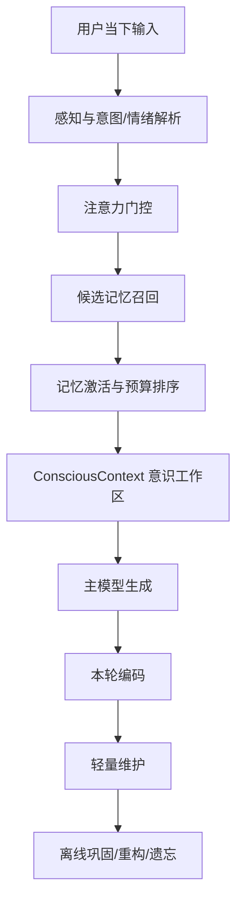

# 类人记忆与 Token 控制设计

## 背景

当前记忆系统已经具备 Working / Episodic / Semantic / Daily / Relationship / UserUnderstanding 等存储层，但生成前的记忆投影仍偏“档案式”：普通聊天也可能把大量用户画像、会话摘要和近期连续性注入 prompt。这样会带来两个问题：

- token 成本随长期相处进入高位平台，尤其是 `user_understanding` 和会话摘要。
- 回复容易显得像在读取资料，而不是像真人一样被当下线索自然唤起记忆。

本设计目标不是减少记忆能力，而是把“完整保存的记忆”和“本轮进入意识的记忆”分开。长期记忆可以丰富，进入主模型 prompt 的内容必须少、准、有情绪和关系线索。

## 类人记忆层次

人类记忆更接近多层激活系统，而不是全量检索表：

| 层次 | 人类表现 | Bot 对应层 |
| --- | --- | --- |
| 感知/瞬时记忆 | 刚听到的话、语气、图片、当前时间 | 当前输入、平台上下文、多模态理解 |
| 工作记忆 | 正在脑中处理的少量上下文 | 最近几轮、当前目标、当前情绪判断 |
| 情景记忆 | “那次我们发生了什么” | Episodic capsule，带场景、情绪、关系含义 |
| 语义记忆 | 稳定事实和偏好 | Semantic facts、UserUnderstanding |
| 自传体记忆 | “我是谁、我经历过什么、我刚刚主动做过什么” | Persona、Life timeline、relationship narrative、self_memory |
| 情绪记忆 | 某些话题触发放软/防御/克制 | Affective profile、sensitive gates |
| 关系记忆 | 我和这个人的共同历程 | RelationshipStore、open emotional threads |
| 程序性记忆 | 习惯、说话肌肉、互动方式 | Speaking style、response polisher |
| 前瞻记忆 | 未来要提醒/追问/履约 | Proactive tasks、commitments |

关键原则：真人并不会每轮“朗读记忆库”。记忆先被线索激活，少数内容进入当下意识，更多内容只影响语气、分寸和反应方向。

## 目标架构



`ConsciousContext` 是每轮真正注入主模型的内容，形态类似：

```json
{
  "current_focus": "用户在轻微撒娇式表达想念",
  "emotional_read": "亲近、试探、需要被接住",
  "active_memories": [
    "用户曾想象在海边牵着杨思思的手唱歌",
    "杨思思刚才主动问候过用户，用户回复了在",
    "最近称呼拉扯会让杨思思害羞嘴硬"
  ],
  "relationship_posture": "亲密上升，但保持杨思思式嘴硬克制",
  "avoid": [
    "不要机械说我记得",
    "不要主动搬出用户创伤和身体隐私"
  ]
}
```

## Token 策略

复杂度应该放在本地检索、排序、低频巩固层，而不是每轮主模型 prompt。

每轮默认预算建议：

| 模块 | 普通聊天 | 情绪/关系/回忆 |
| --- | ---: | ---: |
| Persona | 固定，后续可做摘要缓存 | 固定 |
| 工作记忆最近消息 | 1500-3000 字 | 2500-4500 字 |
| 会话摘要 | 800-1800 字 | 1500-3000 字 |
| 用户短画像 | 800-1500 字 | 1500-3500 字 |
| 关系状态 | 300-800 字 | 800-1500 字 |
| Daily | 0-800 字 | 800-1800 字 |
| Semantic/Episodic | 0-1000 字 | 1000-3000 字 |

原则：

- 存储层不删，prompt 层按意图投影。
- 敏感记忆默认不直接注入，除非用户主动提起或高度相关。
- 低置信记忆只影响语气，不直接断言。
- 旧会话摘要滚动合并，不无限追加。
- 背景事实重复出现时，保留最短、最稳定、最相关的一份。

## 第一阶段落地

本次改动先落高收益、低风险的主链路：

1. 让 `max_summaries` 真正限制工作记忆摘要进入上下文。
2. 给 `MemoryRetriever` 增加 `max_summaries`，使配置传到 `WorkingMemoryStore.load_context()`。
3. 将 `MemoryPromptBuilder` 的用户理解渲染改为按意图投影：
   - 普通聊天使用短画像和少量当前切片。
   - 情绪支持、关系修复、回忆、计划等意图允许更多深层字段进入。
   - 敏感和自定义字段保留能力，但受预算和意图控制。
4. 保持 `format_for_prompt()` 的完整输出，供管理后台或主动唤醒等非主聊天路径继续使用；后续可再给主动唤醒单独加预算。
5. 增加测试，覆盖摘要上限与大用户理解的 prompt 上限。

## 第二阶段落地

在第一阶段的基础上，新增结构化的“意识工作区”：

- `ConsciousContext`：显式表示当前焦点、情绪读取、关系姿态、被唤起的少量记忆、避免事项和记忆使用方式。
- `ConsciousContextBuilder`：从 RetrievedMemory 中选择少量 active memories。优先使用当前意图相关的情景记忆、日常连续性、语义事实和未完成情绪话题。
- `MemoryPromptBuilder`：保持兼容的 `system_suffix`，但在其中加入 `【本轮意识工作区】` 板块，让主模型先看到少量“浮到脑子里”的线索。
- `memory_prompt_diagnostics`：每轮返回各记忆模块的字符数、摘要条数、最近消息数、episodic/semantic 数量，便于继续压 token 和调召回。

这一步仍不改变底层存储，不删除记忆，只改变主模型看到记忆的方式：从“资料拼接”进一步迁移到“当下意识”。

## 第三阶段落地

情景记忆从单纯 `summary/content` 升级为 scene capsule：

- `relationship_effect`：这段共同经历对关系的含义，分为普通、拉近、修复、紧张。
- `sensitivity`：是否为敏感经历。敏感记忆默认不在普通聊天/任务请求里直接浮出，只进入避免规则和分寸控制。
- `recall_style`：以后如何自然使用这段记忆，例如“可轻轻提起，不要炫耀记忆”。
- `cue_tags`：以后可能唤起这段记忆的短线索，如地点、事件、情绪词、承诺。
- 原有 topics、emotion_tags、participants、source_message_ids 保持，用于管理后台和后续召回排序。

这一层更接近人类的情景记忆：人不是只记得一句摘要，而是记得“那次发生了什么、当时是什么感觉、它把关系推近还是拉紧、以后该不该提”。主模型每轮仍只看到少量短句，不会把完整 scene capsule 全量塞进 prompt。

### Scene Capsule 示例

```json
{
  "summary": "用户曾在海边想象牵手唱歌，助手害羞但被触动。",
  "relationship_effect": "拉近",
  "sensitivity": "normal",
  "recall_style": "可轻轻提起，不要炫耀记忆。",
  "cue_tags": ["海边", "牵手", "唱歌"],
  "emotion_tags": ["害羞", "亲近"]
}
```

敏感 capsule 的使用规则：

- 普通聊天、任务请求、计划意图：不主动注入具体内容，只提示“有敏感经历被召回，但不要主动提起具体内容”。
- 情绪支持、关系修复、主动回忆：允许进入意识工作区，但以“敏感共同经历”呈现，并要求模糊、轻放、先确认用户愿不愿继续。
- 存储不删减，入口变窄。这样既保留功能，又避免 token 和越界风险一起膨胀。

## 第四阶段落地

关系记忆从“指标面板”升级为“数值 + 叙事”双轨：

- 数值维度继续保留：`relationship_score`、亲密、信任、好感、紧张、阶段稳定度，供程序判断、后台诊断和长期趋势使用。
- 给 LLM 的主表达新增短叙事：
  - `relationship_narrative`：你们现在像什么关系、亲近到什么程度、最近关键时刻是什么。
  - `current_posture`：这一轮应该采取的关系姿态，例如放慢、克制、自然亲近。
  - `interaction_guidance`：具体互动建议，例如先修复情绪、不要报数值、少量使用共同记忆。
- `MemoryPromptBuilder` 优先渲染关系叙事；如果没有叙事字段才降级显示数值。
- `ConsciousContext` 的关系姿态也优先使用叙事字段，让主模型看到的是“关系语感”，不是“关系仪表盘”。

这样更接近真实人类关系记忆：人通常不是在脑内计算“亲密 55、信任 47”，而是有一个压缩后的关系直觉，比如“我们已经挺熟，但刚才有点绷，要先把对方接住”。Token 上也更省，因为一段短叙事可以替代多行指标解释。

## 第五阶段落地

`UserUnderstanding` 从厚档案升级为四层投影：

- `core`：稳定身份、长期偏好、沟通方式、硬边界和关系期待。普通聊天也可以少量常驻。
- `current`：近期状态、目标、未完成话题、压力源和作息变化。按意图进入 prompt。
- `deep`：情绪模式、有效陪伴方式、亲近与距离模式、价值观、生活背景和关系记忆。只在情绪、关系修复、回忆、主动关心等场景进入。
- `sensitive`：只保存敏感线索和使用边界，不把完整敏感事实作为常规 prompt 内容。普通聊天只看到“不要主动提起”的规则；情绪/关系/回忆场景才允许看到少量敏感线索。

实现上仍保留原来的 `manual`、`auto`、`relationship_memory`，方便用户编辑和管理后台查看；`layered` 是从这些源数据生成的短投影。主聊天优先读取 `layered`，主动唤醒和后台仍可读取完整 `format_for_prompt()`。

这一步把“存很多”和“说得像真人”分开：Bot 可以长期理解用户，但每轮只让少量、当前相关、风险可控的理解进入意识。

## 后续阶段

- 主动消息自我记忆可以从 Daily 投影升级为独立 SelfMemoryStore，长期保存“我主动做过什么、当时为什么、后来用户怎么回应”。
- 夜间巩固把多条事实重写为短画像，把低价值当前状态归档。
- 每轮输出 token 诊断继续扩展到 persona 和最终 messages 总量。
