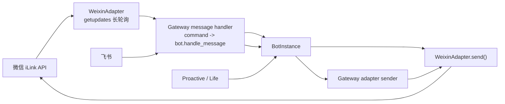

# Phase 7：微信对话通道设计方案

> 状态：核心接入、配置向导、管理面保存、观测运维和 mock iLink 回归测试已落地；真实飞书 + 微信端到端验证待补齐  
> 范围：个人微信 iLink Bot API，与飞书并行运行，不依赖 hermes 运行时

---

## 1. 设计目标

把微信接成与飞书同级的对话入口，满足这几个条件：

1. 网关启动后，飞书和微信可以同时在线。
2. 两边进入的消息都走同一套 `BotInstance`、记忆、命令和主动唤醒逻辑。
3. 微信回复遵循个人微信 iLink API 的收发约束。
4. 配置、状态、日志和数据落在本项目自己的目录里，不运行时依赖 hermes 项目。
5. 默认收口，不默认开放全部 DM / 群聊。

---

## 2. 当前实现状态

| 模块 | 状态 | 说明 |
|---|---|---|
| `ai_companion/gateway/platforms/weixin.py` | 已实现 | 包含 QR 登录、长轮询、文本/媒体收发、context token、typing ticket、消息去重、CDN 下载/上传 |
| `ai_companion/gateway/cmd.py` | 已实现 | 支持飞书 + 微信并行连接，共用一个消息处理器 |
| `ai_companion/bot/instance.py` | 已实现 | 主动唤醒可以通过 gateway adapter 发送到微信 |
| `ai_companion/gateway/config.py` | 已实现 | 支持 `Platform.WEIXIN` 与 `WEIXIN_*` 环境变量 |
| `ai_companion/gateway/platforms/helpers.py` | 已实现 | 提供微信消息去重 helper |
| `ai_companion/setup.py` | 已实现 | 支持微信扫码/手填配置、DM / 群策略、home channel 和主动平台选择 |
| `ai_companion/gateway/admin_services.py` | 已实现 | Web UI schema 展示微信字段，保存 `platforms.weixin.extra / routing / home_channel` |
| `tests/` | 已完成本地回归 | 已覆盖微信 adapter smoke、profile 构建、主动发送、context_token 降级、群聊策略、媒体收发路径和运行态脱敏；真实端到端仍待补 |

---

## 3. 总体架构



### 3.1 组件边界

- `WeixinAdapter` 只负责微信协议细节。
- `cmd.py` 只负责把平台 adapter 接到统一的 Bot 路由上。
- `BotInstance` 只负责业务决策，不关心微信协议。
- `setup.py` 和 `admin_services.py` 负责配置入口，不承载协议逻辑。

---

## 4. 核心流程

### 4.1 入站流程

1. `WeixinAdapter._poll_loop()` 持续拉 `getupdates`。
2. 每条消息先做去重、自发消息过滤、DM / 群聊策略判断。
3. 文本、图片、语音、文件、视频都被转换成 `MessageEvent`。
4. `cmd.py` 的通用 message handler 先处理 `/new`、`/model`、`/status` 等命令。
5. 非命令消息进入 `bot.handle_message()`。
6. 事件来源里的 `platform` / `chat_id` 会写回运行时字段，例如 `_weixin_chat_id`。

### 4.2 出站流程

1. `BotInstance` 生成回复。
2. `WeixinAdapter.format_message()` 做微信可读性整理。
3. 文本按微信长度限制切块发送。
4. 媒体先走 iLink 上传，再发消息体引用 CDN 返回值。
5. 每个 peer 维持独立 `context_token`，过期时自动降级重试。

### 4.3 主动唤醒流程

1. `BotInstance.set_proactive_platform(..., gateway_adapter=...)` 接收统一适配器。
2. 网关在消息入站时记录最近的微信 `chat_id`。
3. 主动消息发送时优先用最近会话，其次用 `home_channel`。
4. 微信平台不支持编辑消息，所以主动内容只走最终发送，不走流式编辑。

---

## 5. 配置与持久化

### 5.1 `config.yaml`

建议配置形态如下：

```yaml
platforms:
  feishu:
    enabled: true
    extra:
      app_id: "cli_xxx"
      app_secret: "xxx"
    routing:
      mode: dedicated
      bot_id: "lin_wanqing"

  weixin:
    enabled: true
    token: "..."
    extra:
      account_id: "..."
      base_url: "https://ilinkai.weixin.qq.com"
      cdn_base_url: "https://novac2c.cdn.weixin.qq.com/c2c"
      dm_policy: "allowlist"
      allow_from: ["wxid_xxx"]
      group_policy: "disabled"
      group_allow_from: []
      split_multiline_messages: false
      send_gradual_sentences: true
      send_gradual_max_chunks: 5
      send_gradual_group_max_chars: 80
      send_gradual_min_delay_seconds: 1.0
      send_chunk_retries: 6
      send_chunk_retry_delay_seconds: 1.5
      send_chunk_retry_max_delay_seconds: 15
    routing:
      mode: dedicated
      bot_id: "lin_wanqing"
    home_channel:
      platform: weixin
      chat_id: "wxid_xxx"
      name: "微信私聊"
```

### 5.2 环境变量

微信相关变量：

- `WEIXIN_TOKEN`
- `WEIXIN_ACCOUNT_ID`
- `WEIXIN_BASE_URL`
- `WEIXIN_CDN_BASE_URL`
- `WEIXIN_DM_POLICY`
- `WEIXIN_GROUP_POLICY`
- `WEIXIN_ALLOWED_USERS`
- `WEIXIN_GROUP_ALLOWED_USERS`
- `WEIXIN_SPLIT_MULTILINE_MESSAGES`
- `WEIXIN_HOME_CHANNEL`
- `WEIXIN_HOME_CHANNEL_NAME`
- `WEIXIN_BOT_ID`

### 5.3 运行时文件

默认写到 `~/.ai-companion/` 下：

- `weixin/accounts/{account_id}.json`：账号 token / base_url / user_id
- `weixin/accounts/{account_id}.context-tokens.json`：每个 peer 的 context token
- `weixin/accounts/{account_id}.sync.json`：`getupdates` 的同步游标

---

## 6. 运行约束

### 6.1 安全边界

- 默认不开放所有 DM。
- 群聊默认关闭。
- 仅允许微信 CDN 白名单域名做媒体下载。
- 远程 URL 下载前先做 SSRF 检查。
- token / account_id 不进入日志正文。

### 6.2 功能边界

- 个人微信通道优先，企业微信单独处理，不混在同一个适配器里。
- 微信消息不做编辑式流式输出。
- 当前按单个微信账号绑定单个 Bot 的方式落地。
- 多账号 / 多绑定属于后续扩展，不是 v1 必须项。

### 6.3 依赖边界

- 运行时只依赖本项目代码。
- 需要 `aiohttp`、`cryptography`、`certifi`、`qrcode`。
- 不在代码里 import hermes 目录。

---

## 7. 仍需完成的边界

1. 给微信媒体路径补完整 mock iLink 回归测试。
1. 用真实飞书 App 与微信 iLink 账号做一次飞书 + 微信同时在线验证。
2. 至少完成一轮真实微信 DM 文本收发和一条图片 / 文件收发。
3. 验证真实环境下 `ai-companion gateway status`、管理 API 和设置页状态与日志输出一致。

---

## 8. 验收标准

完成后应满足：

1. 启动 `ai-companion gateway start` 时，飞书和微信可以同时连接。
2. 微信 DM 可以正常收消息、回消息、收发图片 / 文件。
3. `/new`、`/model`、`/models`、`/status` 在微信里可用。
4. 主动唤醒能从微信 home channel 发消息。
5. 运行时不会 import hermes 项目路径。
6. 关键配置能从 `config.yaml` 和 `WEIXIN_*` 环境变量加载。

---

## 9. 参考代码位置

- `ai_companion/gateway/platforms/weixin.py`
- `ai_companion/gateway/cmd.py`
- `ai_companion/bot/instance.py`
- `ai_companion/gateway/config.py`
- `ai_companion/gateway/platforms/helpers.py`
- `ai_companion/setup.py`
- `ai_companion/gateway/admin_services.py`
